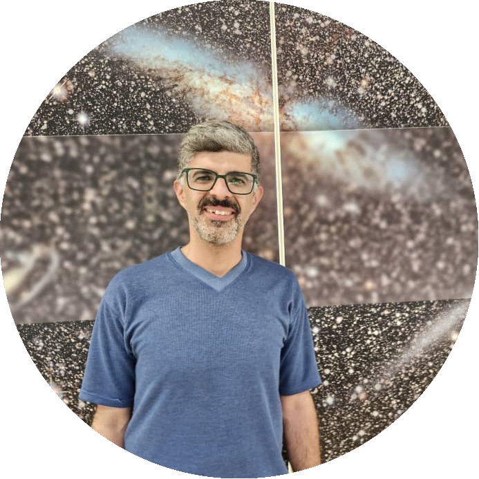

Origins, evolution, and effects of the cosmic magnetic field on structure formation in the universe are among pressing questions in astrophysics and cosmology.  [School of Astronomy (SoA)](https://astro.ipm.ac.ir/) at [Institute of Research in Fundamental Sciences (IPM)](https://www.ipm.ir/) hosts researchers who are actively involved in both observational and theoretical studies of cosmic magnetism on various scales. For a better understanding of the subject it is very insightful to connect theoreticians with observers. The **Cosmic Magnetism Group (CMG)** is hence created to define collaborative projects.

Cosmic Magnetism Group Meeting (CMGM) is the monthly meetings of the CMG to

1- define and progress collaborative projects

2- present the latest findings in the field through journal clubs and free discussions

3- host talks from famous external and international scientists in the field

<!--
 at the SoA in the IPM. 
--->
<!--- Here are another way to add comments in Markdown:)
		[//]: # (comment) 
--->

  

**Meetings:**

CMGMs are held approximately monthly. These meetings usually take place on  **Sundays** or **Tuesdays**<!--, *typically on the first Sunday of each month*,--> at around **10 A.M.** (GMT+03:30) Iran Time in the SoA Seminar Room ([Location](https://www.google.com/maps/place/Institute+for+Astronomy/@35.8039058,51.4900625,17z/data=!4m5!3m4!1s0x3f8e051f03317155:0xb31622adb7a45cc1!8m2!3d35.8053223!4d51.4915255)). Depending on the circumstances, the meetings can be in-person, virtual, or hybrid.

If you would like to attend virtually or in person, please get in touch with the organizers.

 
 

**Organizer(s):**

  
  

  	Alireza Talebian
  	 
  	<a href = "mailto: talebian@ipm.ir"> talebian@ipm.ir </a>
  

 
 

**Next Event:**
TBA

<!--

Tap <a target="_blank" href="https://calendar.google.com/calendar/u/0/r/eventedit?text=Cosmic+Magnetism+Group+Meeting&dates=20240804T063000Z/20240804T073000Z&ctz=Asia/Tehran&details=Talk+by+Alireza+Karamzadeh%3Ch2%3E%3C/h2%3E%3Cul%3E%3Cli%3ETitle:+The+imprint+of+primordial+magnetic+field+on+the+morphology+of+21-cm+fluctuations%3C/li%3E%20%3Cli%3EAbstract:+In+this+talk,+I+am+going+to+explain+the+21-cm+line,+the+importance+of+such+emission+in+studying+magnetic+fields,+and+all+I+know+about+the+relation+between+the+21-cm+line+and+primordial+magnetic+fields+based+on+the+newest+papers+and+presentations.%3C/li%3E%20%3C/ul%3E%3Cp%3EJoin%20us+at+%20%20%3Ca%20href=%22https://www.google.com/maps/place/Institute+for+Astronomy/@35.8039058,51.4900625,17z/data=!4m5!3m4!1s0x3f8e051f03317155:0xb31622adb7a45cc1!8m2!3d35.8053223!4d51.4915255%22%3ESoA+Seminar+Room%3C/a%3E+or+virtually+via%20%20%3Ca%20href=%22https://meet.google.com/jxg-piii-cau%22%3EGoogle+Meet+platform%3C/a%3E%3C/p%3E&location=Hybrid"></a> to easily add it to your Google Calendar!

| Date                | Description | Location |
|:--------------------|:--------|:--------|
|1 Oct (10 Mehr) |[ Free Discussion on **Electromagnetic Biotsavart Law**](/Meetings/arxiv/27_08_2024_Asiyeh_Yaghoobi_MF_RT) | Hybrid ( [in-person](https://www.google.com/maps/place/Institute+for+Astronomy/@35.8039058,51.4900625,17z/data=!4m5!3m4!1s0x3f8e051f03317155:0xb31622adb7a45cc1!8m2!3d35.8053223!4d51.4915255) / [virtual](???? - https://meet.google.com/agf-comq-gfw) )  |
|:--------------------|:--------|:---------|:---------|
{: rules="groups"}
If you would like to attend virtually or in person, please get in touch with the organizers.

-->

 
 

**Recent Get-Togethers:**

| Date                | Description |
|:--------------------|:--------|
|1 Oct 2024 (10 Mehr 1403) |[ Free Discussion: **Biot-Savart Law in Cosmic Scales**](/Meetings/arxiv/01_10_2024_Electromagnetic_Biot̲savart_Law) | Hybrid ( [in-person](https://www.google.com/maps/place/Institute+for+Astronomy/@35.8039058,51.4900625,17z/data=!4m5!3m4!1s0x3f8e051f03317155:0xb31622adb7a45cc1!8m2!3d35.8053223!4d51.4915255) / [virtual](???? - https://meet.google.com/agf-comq-gfw) )  |
|:--------------------|:--------|:---------|:---------|
|4 Aug 2024 (14 Mordad 1403) |[ Talk by **Dr. Asiyeh Yaghoobi** (IPM) on **MF and the Rayleigh–Taylor Instability**](/Meetings/arxiv/27_08_2024_Asiyeh_Yaghoobi_MF_RT) | Hybrid ( [in-person](https://www.google.com/maps/place/Institute+for+Astronomy/@35.8039058,51.4900625,17z/data=!4m5!3m4!1s0x3f8e051f03317155:0xb31622adb7a45cc1!8m2!3d35.8053223!4d51.4915255) / [virtual](???? - https://meet.google.com/jxg-piii-cau) )  |
|:--------------------|:--------|:---------|:---------|
|4 Aug (14 Mordad) |[ Talk by **Alireza Karamzadeh** (SBU) on **PMF and 21 cm**](/Meetings/arxiv/04_08_2024_Alireza_Karamzadeh_21cm_PMF) | Hybrid ( [in-person](https://www.google.com/maps/place/Institute+for+Astronomy/@35.8039058,51.4900625,17z/data=!4m5!3m4!1s0x3f8e051f03317155:0xb31622adb7a45cc1!8m2!3d35.8053223!4d51.4915255) / [virtual](???? - https://meet.google.com/jxg-piii-cau) )  |
|:--------------------|:--------|
|... | ... |
{: rules="groups"}
[Meetings Archive](/Meetings/archive)

 
 

<!---
**Current Status:**
--->
 
 
 

- **Email:**
<a href = "mailto: cmgmipm@gmail.com"> cmgmipm@gmail.com </a>
 
- **Web:** [ipm-cmg.github.io](https://ipm-cmg.github.io)
 
- **Github:** [github.com/ipm-cmg](https://github.com/ipm-cmg)

<!---
email: **cmgmipm@gmail.com**

web: **https://ipm-cmg.github.io**

Special thanks to S.Mohammad Hosseinirad for his invaluable contributions to this website.

[https://github.com/ipm-oam](https://github.com/ipm-oam/ipm-oam.github.io)

[ipm-oam.github.io](https://ipm-oam.github.io)
--->

